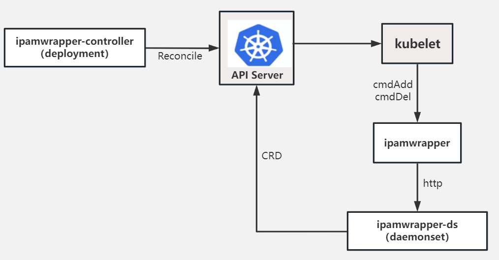

# k8-ipam

## 介绍

k8-ipam是一个 kubernetes 的 IPAM 插件项目， 针对云原生网络的 IP 地址管理需求而设计，并且可以与开源社区中主流开源CNI项目兼容，如Calico、Cilium、kube-ovn等，为其提供IP地址管理功能。当前开源社区中已有部分IPAM项目，典型的如whereabouts、calico-ipam，暂时还没有一个IPAM插件可以满足云原生场景中的所有IPAM需求，例如Pod固定IP功能，虽然Calico-ipam和kube-ovn可以实现该功能，但都通过hard-code方式实现，灵活性较低。k8-ipam旨在解决云原生场景中Pod固定IP、子网、定制化路由、IPv4/IPv6双栈、预留IP等需求，并基于kubernetes CRD进行管理，极大简化IPAM的运维管理工作。

## 关键功能

| 功能          | 描述                                                         | 实现程度 |
| :------------ | ------------------------------------------------------------ | -------- |
| 应用固定IP    | 对于无状态应用，可实现固定IP范围，并且能根据应用的副本数进行IP资源池的自动扩缩容；对于有状态应用，可实现每个Pod固定IP地址，同时支持有状态应用副本扩缩容 | 暂未实现 |
| IPv4/IPv6双栈 | 支持为Pod分配IPv4和IPv6双栈地址，满足云原生双栈场景          | 暂未实现 |
| VPC           | 支持创建自定义VPC, 每个子网隶属于一个VPC, VPC存储子网的公共属性   | 暂未实现 |
| 子网          | 支持创建自定义子网，并支持子网与命名空间绑定，在绑定了子网的命名空间内创建应用时，IP将在绑定的子网内分配IP | 暂未实现 |
| 定制化路由    | 支持自定义路由功能，用户自行规划路由规则并通过参数传入IPAM，后续创建出的Pod内即可带有自定义的路由信息 | 暂未实现 |
| 预留IP        | 支持预留IP功能，预留IP的生效范围为整个集群，在预留IP内指定的IP将不会被分配，保证IP不会 | 暂未实现 |

## 架构

 

如上架构图所示，k8-ipam主要由三个部分构成：

- k8-ipam：安装在每个节点上的二进制文件，被存放在/opt/cni/bin路径下，提供了标准接口cmdAdd和cmdDel，当被kubelet调用时在二进制内只会组装相关参数并发起http请求，真正分配IP和释放IP的操作在k8-ipam-ds内实现
- k8-ipam-ds：以daemonset形式部署在集群内每个节点上，负责IP的申请、释放等具体功能，并通过http-server对外提供服务，供k8-ipam调用
- k8-ipam-controller：以deployment形式部署在集群内，如果是多副本则需要有选主操作。主要通过调谐使集群内IPAM相关资源达到预期状态，并负责资源的清理及回收操作，另外还通过webhook机制实现一些权限校验等操作

## 快速搭建

参考[快速搭建](./docs/install.md)

## RoadMap

参考[roadmap](roadmap.md)

## 样例

## 联系我们

 - 我们来自浪潮云海k8s开发团队

 - 欢迎有想法的小伙伴参与此项目中

   
